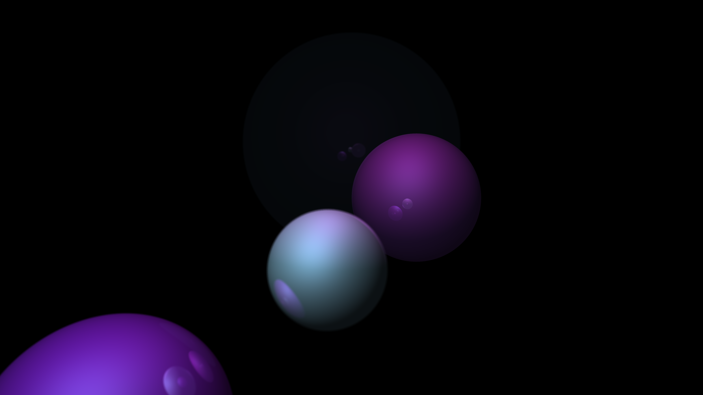

# Ray Tracer

Implementation of a simple ray tracer in C++ .
*   Supports loading of .obj files and textures .  
*  Sample outputs in SampleImages Folder.  
* Implemented Anti-aliasing (SSAA) and Depth Of Field .  

## How To Run This
* Clone the repository to your PC / Laptop
* Download [OpenGL Mathematics (glm)](https://glm.g-truc.net/0.9.9/index.html)
* Extract the zip anywhere and copy the glm/glm folder.
* Make a folder named "Deps" at the location where you cloned the repo. Put the above folder inside this.
* That's it! Open the RayTracer.sln file and press Ctrl+B to build the project.
* Go to the release folder and run the RayTracer.exe file. 
	* If asked for textures, use only .jpg textures.
	* Enter a scene ID between 0 and 9.
* The result image is stored in a .ppm file which can be easily converted to any other format.
* (Optional) If you want the result as .png directly :
	* Install [ImageMagick](https://imagemagick.org/script/download.php) for Windows.
	* Now the result will be generated both as a .ppm file and a .png file.
	
## Bug/Feature Request
If you find a bug, or are unable to build the project or run the application, kindly open an issue [here](https://github.com/The-curs0r/RayTracer/issues/new?assignees=&labels=&template=bug_report.md&title=).

Currently I'm not working on this project but if you have any ideas for the project, please put them [here](https://github.com/The-curs0r/RayTracer/issues/new?assignees=&labels=&template=feature_request.md&title=).

## To-Do
* Implement MSAA and/or Post Processing Anti Aliasing methods (like MLAA, FXAA and SMAA).
* Comment the code.
* Add more basic shapes (like Torus, Cubes).
* Improve lighting calculations (add glossy reflection and area lights).

## Results
* More images in SampleImages folder.

