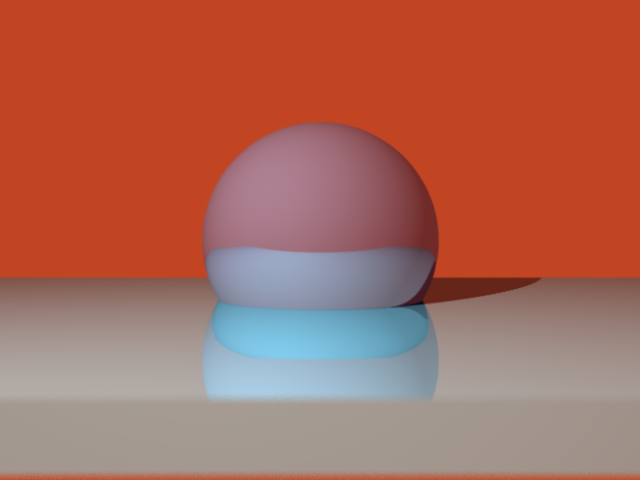
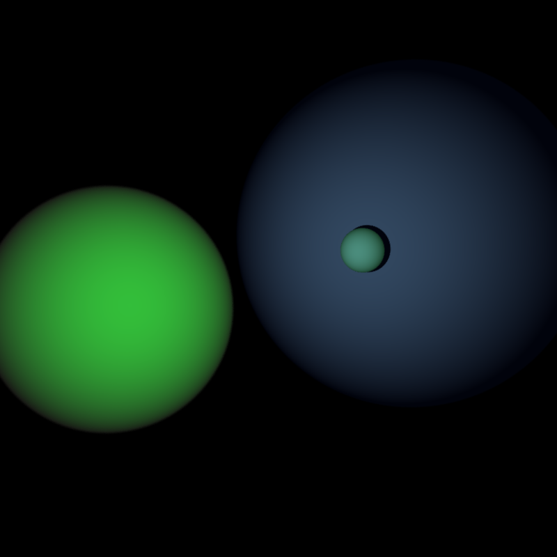
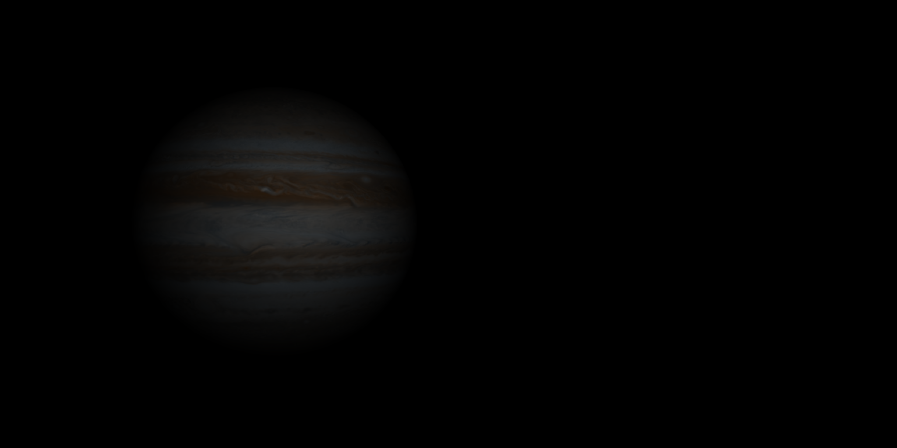

# Ray Tracer

Implementation of a simple ray tracer in C++ .  
Supports loading of .obj files and textures .  
Sample outputs in ./SampleImages .  
Also implemented Anti-aliasing and Depth Of Field .  

## Outputs : 

